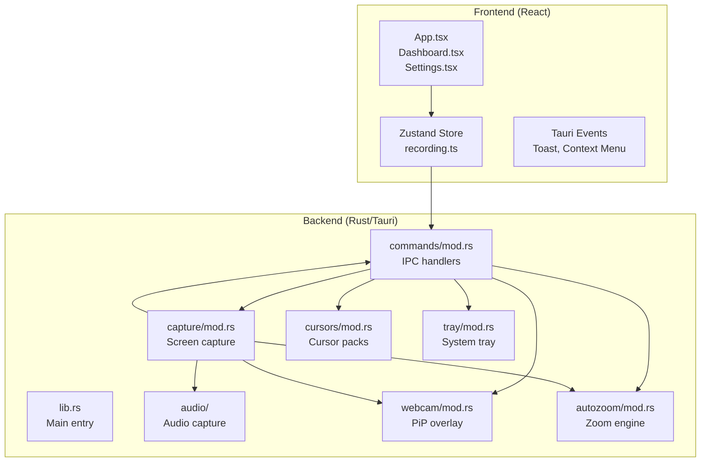
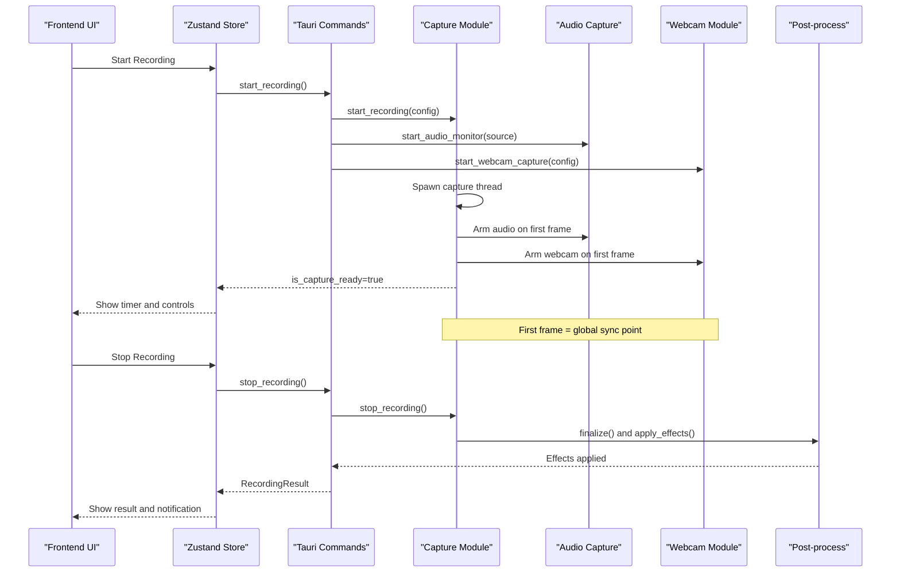
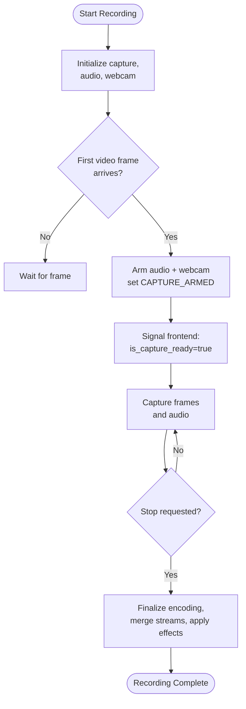
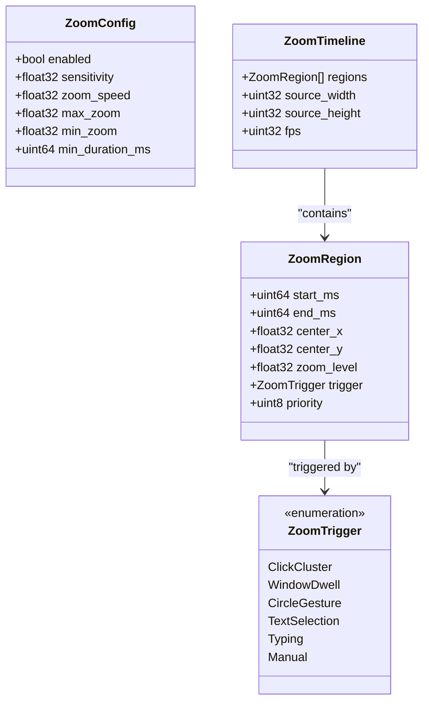
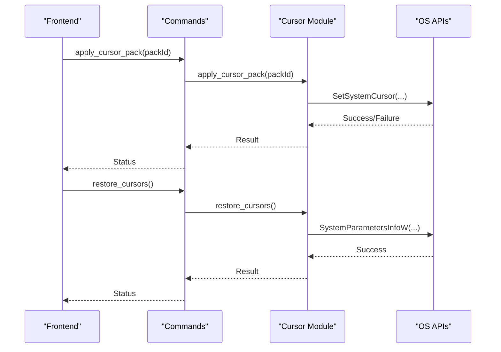
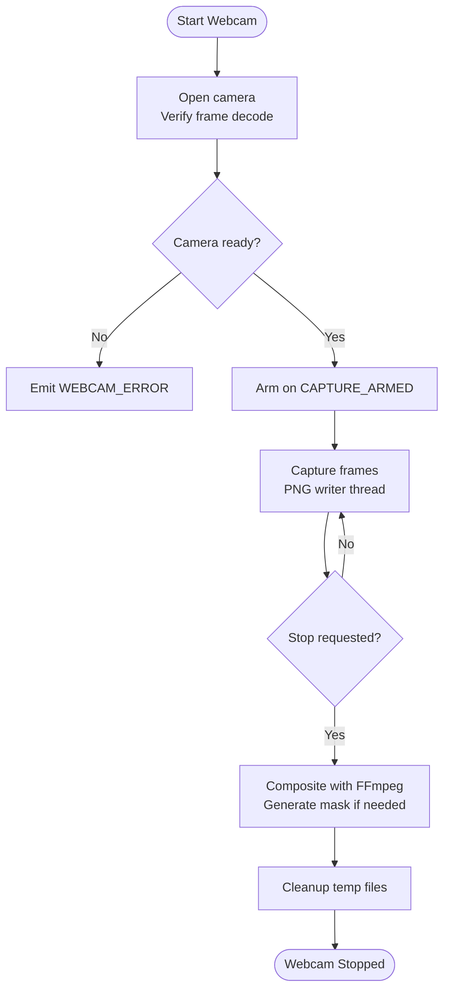
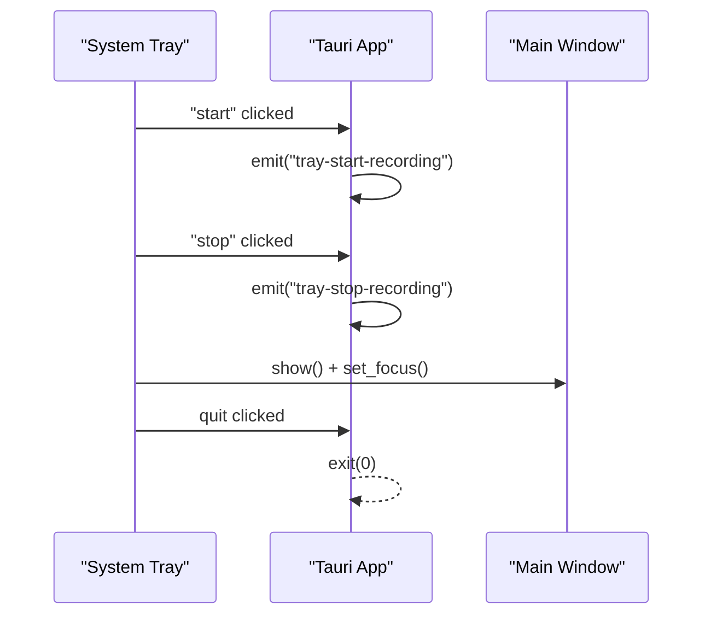
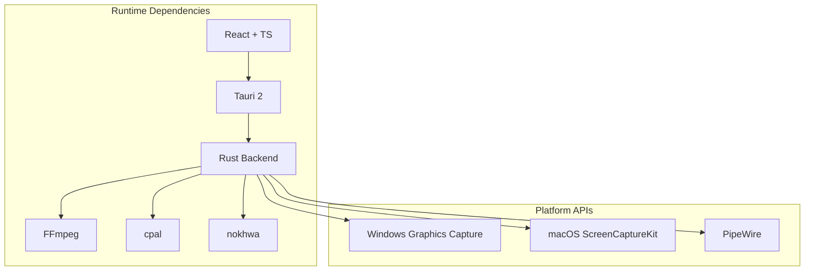

# Project Overview

<cite>
**Referenced Files in This Document**
- [README.md](file://README.md)
- [package.json](file://package.json)
- [Cargo.toml](file://src-tauri/Cargo.toml)
- [tauri.conf.json](file://src-tauri/tauri.conf.json)
- [App.tsx](file://src/App.tsx)
- [Dashboard.tsx](file://src/components/Dashboard.tsx)
- [Settings.tsx](file://src/components/Settings.tsx)
- [recording.ts](file://src/stores/recording.ts)
- [lib.rs](file://src-tauri/src/lib.rs)
- [mod.rs (autozoom)](file://src-tauri/src/autozoom/mod.rs)
- [mod.rs (webcam)](file://src-tauri/src/webcam/mod.rs)
- [mod.rs (cursors)](file://src-tauri/src/cursors/mod.rs)
- [mod.rs (tray)](file://src-tauri/src/tray/mod.rs)
- [mod.rs (commands)](file://src-tauri/src/commands/mod.rs)
- [mod.rs (capture)](file://src-tauri/src/capture/mod.rs)
</cite>

## Table of Contents
1. [Introduction](#introduction)
2. [Project Structure](#project-structure)
3. [Core Components](#core-components)
4. [Architecture Overview](#architecture-overview)
5. [Detailed Component Analysis](#detailed-component-analysis)
6. [Dependency Analysis](#dependency-analysis)
7. [Performance Considerations](#performance-considerations)
8. [Troubleshooting Guide](#troubleshooting-guide)
9. [Conclusion](#conclusion)

## Introduction
EasySpecy is a free, open-source, cross-platform screen recorder designed to deliver professional-grade screen capture with cinematic enhancements. It focuses on intuitive controls, high-quality output, and advanced post-processing features such as auto-zoom and cursor effects. The application emphasizes seamless integration across Windows, macOS, and Linux, combining a modern React frontend with a high-performance Rust backend powered by Tauri 2.

Key value propositions:
- Professional screen recording with configurable quality and flexible capture modes
- Cinematic auto-zoom and cursor effects for engaging content
- Webcam overlay with shape masks and real-time compositing
- System-wide hotkeys, system tray integration, and immediate save functionality
- Cross-platform support with native OS APIs and FFmpeg-based encoding

## Project Structure
The project follows a hybrid architecture:
- Frontend: React + TypeScript with Tailwind CSS for UI and state management via Zustand
- Backend: Rust/Tauri 2 for system integration, capture, audio, and encoding
- Shared features: Post-processing pipeline for auto-zoom, cursor trails, and effects

**Diagram sources**
- [App.tsx:17-189](file://src/App.tsx#L17-L189)
- [Dashboard.tsx:218-573](file://src/components/Dashboard.tsx#L218-L573)
- [Settings.tsx:40-733](file://src/components/Settings.tsx#L40-L733)
- [recording.ts:176-404](file://src/stores/recording.ts#L176-L404)
- [lib.rs:38-126](file://src-tauri/src/lib.rs#L38-L126)
- [mod.rs (commands):11-690](file://src-tauri/src/commands/mod.rs#L11-L690)
- [mod.rs (capture):163-404](file://src-tauri/src/capture/mod.rs#L163-L404)
- [mod.rs (webcam):41-156](file://src-tauri/src/webcam/mod.rs#L41-L156)
- [mod.rs (autozoom):1-101](file://src-tauri/src/autozoom/mod.rs#L1-L101)
- [mod.rs (cursors):64-98](file://src-tauri/src/cursors/mod.rs#L64-L98)
- [mod.rs (tray):9-55](file://src-tauri/src/tray/mod.rs#L9-L55)

**Section sources**
- [README.md:1-63](file://README.md#L1-L63)
- [package.json:1-36](file://package.json#L1-L36)
- [Cargo.toml:1-61](file://src-tauri/Cargo.toml#L1-L61)
- [tauri.conf.json:1-48](file://src-tauri/tauri.conf.json#L1-L48)

## Core Components
- Screen Recording Engine: Implements synchronized capture of screen, audio, and webcam with region cropping and FFmpeg-based merging
- Auto-Zoom Pipeline: Analyzes cursor movements, clicks, and keyboard activity to generate cinematic zoom timelines
- Cursor Effects: Provides customizable cursor packs, trails, click effects, and smoothing for polished output
- Webcam Overlay: Captures webcam frames, applies shape masks, and composites overlays with precise timing
- System Integration: Global hotkeys, system tray, and native OS APIs for seamless operation
- Frontend Dashboard: Intuitive controls for configuration, recording, and library management

**Section sources**
- [Dashboard.tsx:218-573](file://src/components/Dashboard.tsx#L218-L573)
- [Settings.tsx:40-733](file://src/components/Settings.tsx#L40-L733)
- [recording.ts:176-404](file://src/stores/recording.ts#L176-L404)
- [mod.rs (capture):163-404](file://src-tauri/src/capture/mod.rs#L163-L404)
- [mod.rs (autozoom):1-101](file://src-tauri/src/autozoom/mod.rs#L1-L101)
- [mod.rs (webcam):41-156](file://src-tauri/src/webcam/mod.rs#L41-L156)
- [mod.rs (cursors):64-98](file://src-tauri/src/cursors/mod.rs#L64-L98)
- [mod.rs (tray):9-55](file://src-tauri/src/tray/mod.rs#L9-L55)

## Architecture Overview
The system uses a producer-consumer model with strict synchronization:
- Initialization: Frontend triggers backend commands to start capture, audio, and webcam threads
- Synchronization: First video frame acts as a global sync point for audio and webcam
- Real-time: Mouse tracking and keyboard capture feed metadata for post-processing
- Encoding: FFmpeg merges streams, crops regions, composites webcam overlays, and applies effects

**Diagram sources**
- [mod.rs (commands):216-370](file://src-tauri/src/commands/mod.rs#L216-L370)
- [mod.rs (capture):163-404](file://src-tauri/src/capture/mod.rs#L163-L404)
- [mod.rs (webcam):103-156](file://src-tauri/src/webcam/mod.rs#L103-L156)
- [recording.ts:308-336](file://src/stores/recording.ts#L308-L336)

## Detailed Component Analysis

### Screen Recording Engine
Implements synchronized capture with:
- Region capture via FFmpeg crop filter
- Audio capture with CPAL and WAV temp storage
- Webcam capture with shape masks and compositing
- Encoding progress reporting via FFmpeg -progress pipe

**Diagram sources**
- [mod.rs (capture):105-158](file://src-tauri/src/capture/mod.rs#L105-L158)
- [mod.rs (capture):502-714](file://src-tauri/src/capture/mod.rs#L502-L714)

**Section sources**
- [mod.rs (capture):163-404](file://src-tauri/src/capture/mod.rs#L163-L404)
- [mod.rs (commands):216-370](file://src-tauri/src/commands/mod.rs#L216-L370)

### Auto-Zoom Engine
Analyzes cursor positions, click events, window bounds, and keyboard activity to generate cinematic zoom timelines. Uses spring physics for smooth transitions and integrates with the post-processing pipeline.

**Diagram sources**
- [mod.rs (autozoom):16-101](file://src-tauri/src/autozoom/mod.rs#L16-L101)

**Section sources**
- [mod.rs (autozoom):1-101](file://src-tauri/src/autozoom/mod.rs#L1-L101)

### Cursor Effects and Packs
Provides customizable cursor packs (built-in macOS, Posy, EasySpecy) and runtime cursor swapping during recording. Includes trail rendering and click effects for cinematic output.

**Diagram sources**
- [mod.rs (cursors):64-98](file://src-tauri/src/cursors/mod.rs#L64-L98)
- [mod.rs (commands):206-214](file://src-tauri/src/commands/mod.rs#L206-L214)

**Section sources**
- [mod.rs (cursors):64-98](file://src-tauri/src/cursors/mod.rs#L64-L98)
- [Settings.tsx:469-591](file://src/components/Settings.tsx#L469-L591)

### Webcam Overlay Pipeline
Captures webcam frames, generates shape masks, and composites overlays with precise timing aligned to video and audio.

**Diagram sources**
- [mod.rs (webcam):41-156](file://src-tauri/src/webcam/mod.rs#L41-L156)
- [mod.rs (webcam):234-328](file://src-tauri/src/webcam/mod.rs#L234-L328)

**Section sources**
- [mod.rs (webcam):41-156](file://src-tauri/src/webcam/mod.rs#L41-L156)
- [mod.rs (webcam):234-328](file://src-tauri/src/webcam/mod.rs#L234-L328)

### System Tray Integration
Provides a system tray with start/stop actions, show window, and quit options. Integrates with global hotkeys and emits events to the main window.

**Diagram sources**
- [mod.rs (tray):9-55](file://src-tauri/src/tray/mod.rs#L9-L55)

**Section sources**
- [mod.rs (tray):9-55](file://src-tauri/src/tray/mod.rs#L9-L55)

## Dependency Analysis
Technology stack and external dependencies:
- Framework: Tauri 2 with Rust backend and React frontend
- Native APIs: Windows Graphics Capture, macOS ScreenCaptureKit, PipeWire on Linux
- Audio: cpal for cross-platform audio I/O
- Encoding: FFmpeg (bundled) for video/audio merging and filters
- UI: React + TypeScript + Tailwind CSS
- State: Zustand for lightweight store management

**Diagram sources**
- [Cargo.toml:26-61](file://src-tauri/Cargo.toml#L26-L61)
- [package.json:12-35](file://package.json#L12-L35)
- [tauri.conf.json:1-48](file://src-tauri/tauri.conf.json#L1-L48)

**Section sources**
- [Cargo.toml:26-61](file://src-tauri/Cargo.toml#L26-L61)
- [package.json:12-35](file://package.json#L12-L35)
- [tauri.conf.json:1-48](file://src-tauri/tauri.conf.json#L1-L48)

## Performance Considerations
- Synchronized capture minimizes latency and ensures perfect sync between video, audio, and webcam streams
- Producer-consumer design for webcam capture prevents frame drops
- Real-time FFmpeg progress reporting enables responsive UI feedback
- GPU-accelerated encoders (NVENC/AMF/QSV) are auto-detected and used when available
- Region capture reduces file size and encoding time
- Cursor metadata collected at high frequency (120Hz) for smooth post-processing

## Troubleshooting Guide
Common issues and resolutions:
- Webcam device contention: The system releases browser webcam streams before starting backend capture
- FFmpeg not found: Ensure FFmpeg is available in PATH or bundled with the application
- Audio device initialization failures: Verify microphone permissions and device availability
- Recording desync: The system performs sync verification and logs warnings if detected
- Tray actions not responding: Confirm Tauri plugins are properly initialized

**Section sources**
- [mod.rs (commands):234-264](file://src-tauri/src/commands/mod.rs#L234-L264)
- [mod.rs (capture):768-800](file://src-tauri/src/capture/mod.rs#L768-L800)
- [mod.rs (webcam):83-101](file://src-tauri/src/webcam/mod.rs#L83-L101)

## Conclusion
EasySpecy delivers a robust, cross-platform screen recording solution with advanced cinematic features. Its architecture balances performance and usability, leveraging native OS APIs and FFmpeg for professional-quality output. The combination of auto-zoom, cursor effects, webcam overlays, and system integration makes it suitable for content creators, educators, and professionals who need reliable, high-quality screen capture with minimal post-processing overhead.