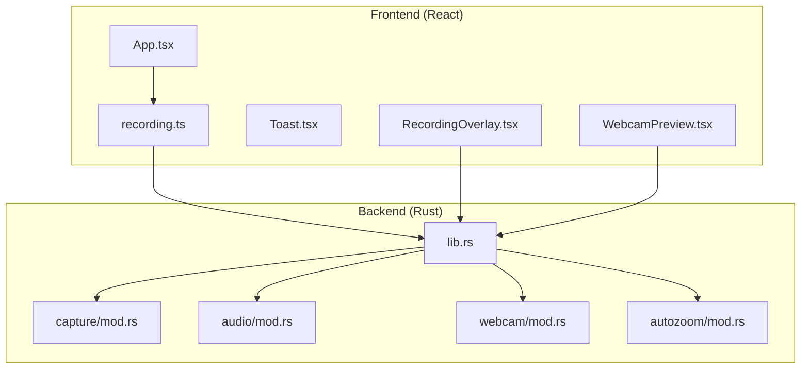
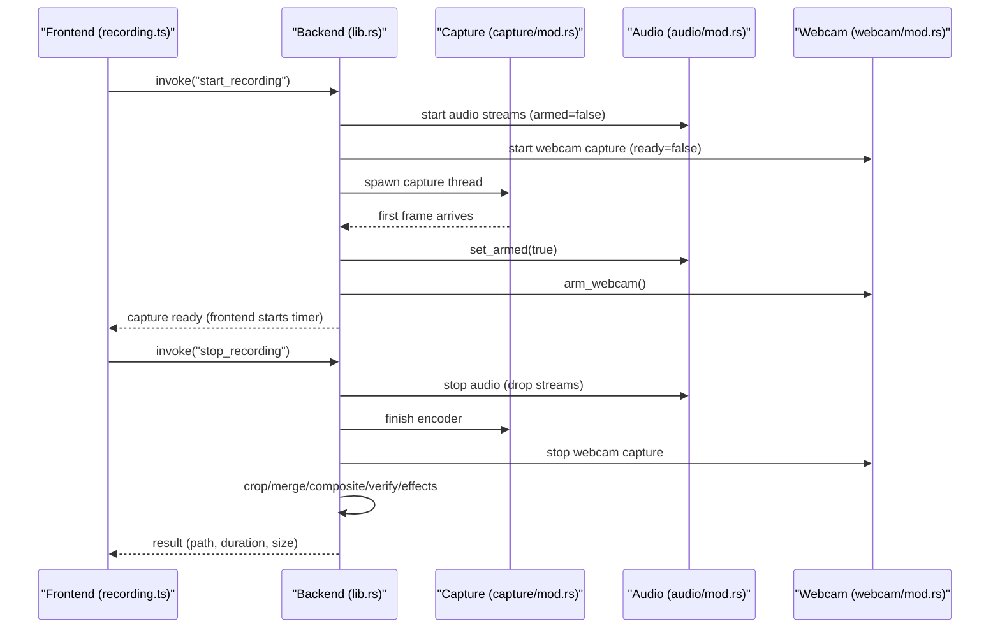
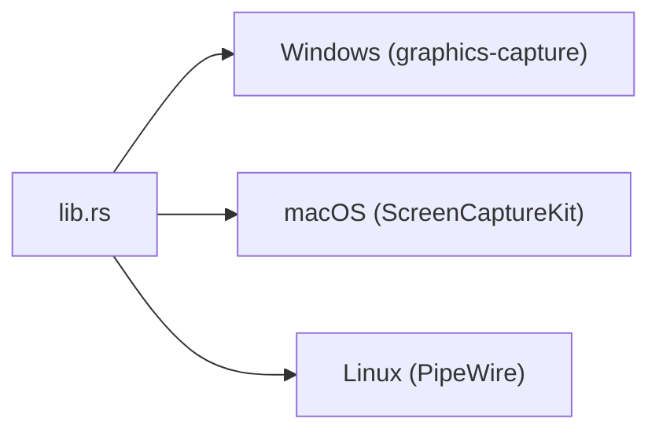

# Troubleshooting & FAQ

<cite>
**Referenced Files in This Document**
- [README.md](file://README.md)
- [Cargo.toml](file://src-tauri/Cargo.toml)
- [tauri.conf.json](file://src-tauri/tauri.conf.json)
- [lib.rs](file://src-tauri/src/lib.rs)
- [main.rs](file://src-tauri/src/main.rs)
- [mod.rs (capture)](file://src-tauri/src/capture/mod.rs)
- [mod.rs (audio)](file://src-tauri/src/audio/mod.rs)
- [mod.rs (webcam)](file://src-tauri/src/webcam/mod.rs)
- [mod.rs (autozoom)](file://src-tauri/src/autozoom/mod.rs)
- [App.tsx](file://src/App.tsx)
- [recording.ts](file://src/stores/recording.ts)
- [Toast.tsx](file://src/components/Toast.tsx)
- [RecordingOverlay.tsx](file://src/components/RecordingOverlay.tsx)
- [WebcamPreview.tsx](file://src/components/WebcamPreview.tsx)
</cite>

## Table of Contents
1. [Introduction](#introduction)
2. [Project Structure](#project-structure)
3. [Core Components](#core-components)
4. [Architecture Overview](#architecture-overview)
5. [Detailed Component Analysis](#detailed-component-analysis)
6. [Dependency Analysis](#dependency-analysis)
7. [Performance Considerations](#performance-considerations)
8. [Troubleshooting Guide](#troubleshooting-guide)
9. [Conclusion](#conclusion)
10. [Appendices](#appendices)

## Introduction
This document provides comprehensive troubleshooting guidance and FAQs for EasySpecy, a cross-platform screen recorder with auto-zoom and cursor effects. It covers screen capture failures, audio recording problems, visual effects rendering issues, performance optimization tips, platform-specific problems (Windows permissions, macOS sandboxing, Linux dependencies), memory usage concerns, diagnostic procedures, log analysis, debugging techniques, and step-by-step resolution guides for typical user-reported issues.

## Project Structure
EasySpecy uses a Tauri 2 architecture with a Rust backend and a React/TypeScript frontend. The backend manages screen capture, audio, webcam overlays, and encoding; the frontend handles UI, hotkeys, notifications, and user controls.

**Diagram sources**
- [lib.rs:85-135](file://src-tauri/src/lib.rs#L85-L135)
- [mod.rs (capture):163-404](file://src-tauri/src/capture/mod.rs#L163-L404)
- [mod.rs (audio):225-553](file://src-tauri/src/audio/mod.rs#L225-L553)
- [mod.rs (webcam):41-156](file://src-tauri/src/webcam/mod.rs#L41-L156)
- [mod.rs (autozoom):1-101](file://src-tauri/src/autozoom/mod.rs#L1-L101)
- [App.tsx:17-60](file://src/App.tsx#L17-L60)
- [recording.ts:283-336](file://src/stores/recording.ts#L283-L336)
- [RecordingOverlay.tsx:18-87](file://src/components/RecordingOverlay.tsx#L18-L87)
- [WebcamPreview.tsx:71-140](file://src/components/WebcamPreview.tsx#L71-L140)

**Section sources**
- [README.md:1-63](file://README.md#L1-L63)
- [tauri.conf.json:1-48](file://src-tauri/tauri.conf.json#L1-L48)
- [Cargo.toml:1-61](file://src-tauri/Cargo.toml#L1-L61)

## Core Components
- Screen capture and encoding: synchronous start via capture module; FFmpeg used for cropping, merging audio/video, and overlays.
- Audio capture: cpal streams for mic/system audio; synchronized start on first video frame; mixing and resampling.
- Webcam overlay: camera capture via nokhwa; producer-consumer frame writing; FFmpeg compositing with shape masks.
- Auto-zoom and cursor effects: cursor tracking thread emits events; overlay renders trails and click effects; postprocessing applies effects to video.
- Frontend stores and UI: hotkeys, toast notifications, encoding progress polling, webcam preview, and recording overlay.

**Section sources**
- [mod.rs (capture):163-714](file://src-tauri/src/capture/mod.rs#L163-L714)
- [mod.rs (audio):225-553](file://src-tauri/src/audio/mod.rs#L225-L553)
- [mod.rs (webcam):41-156](file://src-tauri/src/webcam/mod.rs#L41-L156)
- [mod.rs (autozoom):1-101](file://src-tauri/src/autozoom/mod.rs#L1-L101)
- [recording.ts:283-336](file://src/stores/recording.ts#L283-L336)
- [RecordingOverlay.tsx:18-113](file://src/components/RecordingOverlay.tsx#L18-L113)

## Architecture Overview
The recording lifecycle is tightly synchronized:
- Frontend invokes start_recording; backend initializes audio and webcam, then spawns a capture thread.
- On the first video frame, audio and webcam are armed simultaneously, and the frontend begins recording.
- During stop_recording, the backend merges audio/video, crops region if needed, composites webcam, verifies sync, and applies effects.

**Diagram sources**
- [lib.rs:85-135](file://src-tauri/src/lib.rs#L85-L135)
- [mod.rs (capture):163-280](file://src-tauri/src/capture/mod.rs#L163-L280)
- [mod.rs (audio):251-381](file://src-tauri/src/audio/mod.rs#L251-L381)
- [mod.rs (webcam):122-156](file://src-tauri/src/webcam/mod.rs#L122-L156)
- [recording.ts:308-336](file://src/stores/recording.ts#L308-L336)

## Detailed Component Analysis

### Screen Capture Failures
Common symptoms:
- Recording never starts; capture never becomes ready.
- Immediate crash or timeout waiting for capture thread.

Root causes and diagnostics:
- Capture thread initialization errors or OS capture API failures.
- Missing or misconfigured FFmpeg.
- Region capture with invalid geometry.
- Permissions or driver issues on Windows/macOS/Linux.

Resolution steps:
1. Verify FFmpeg availability and path in the environment.
2. Try FullScreen mode first; if region fails, disable region mode and retry.
3. Restart the app to clear stale capture state.
4. On Windows, ensure the app is not blocked by UAC or antivirus; run as administrator if needed.
5. On macOS, check Screen Recording permissions in System Settings.
6. On Linux, ensure PipeWire/PulseAudio is running and accessible.

**Section sources**
- [mod.rs (capture):163-280](file://src-tauri/src/capture/mod.rs#L163-L280)
- [mod.rs (capture):502-536](file://src-tauri/src/capture/mod.rs#L502-L536)
- [lib.rs:85-135](file://src-tauri/src/lib.rs#L85-L135)

### Audio Recording Problems
Common symptoms:
- No audio recorded.
- Audio mismatch or desync.
- Mic/System device not detected.

Root causes and diagnostics:
- cpal device enumeration failures.
- WASAPI exclusive mode or device contention.
- Sample-rate mismatches or unsupported formats.
- Noise reduction/post-processing affecting levels.

Resolution steps:
1. Select a different audio device in Settings.
2. Switch audio source between Mic, System, or Both.
3. Lower noise reduction strength or disable it temporarily.
4. Ensure the app has microphone/system audio permissions.
5. If “Both” mode is used, verify system volume balance.

**Section sources**
- [mod.rs (audio):225-553](file://src-tauri/src/audio/mod.rs#L225-L553)
- [mod.rs (audio):385-540](file://src-tauri/src/audio/mod.rs#L385-L540)
- [recording.ts:348-402](file://src/stores/recording.ts#L348-L402)

### Visual Effects Rendering Issues
Common symptoms:
- Trails or click effects not visible.
- Recording overlay not rendering.
- Webcam overlay not appearing.

Root causes and diagnostics:
- Overlay window not receiving cursor events (click-through behavior).
- Missing or corrupted effect assets.
- Incorrect overlay geometry or opacity.

Resolution steps:
1. Confirm RecordingOverlay is active and window is click-through.
2. Adjust cursor trail and click effect settings.
3. In WebcamPreview, verify device selection and adjust brightness/contrast/sharpen.
4. Re-enter region mode and restart recording to refresh overlay state.

**Section sources**
- [RecordingOverlay.tsx:18-113](file://src/components/RecordingOverlay.tsx#L18-L113)
- [mod.rs (autozoom):1-101](file://src-tauri/src/autozoom/mod.rs#L1-L101)
- [WebcamPreview.tsx:71-140](file://src/components/WebcamPreview.tsx#L71-L140)

### Webcam Overlay Problems
Common symptoms:
- Webcam fails to initialize.
- Webcam overlay appears distorted or misplaced.
- Mask compositing fails.

Root causes and diagnostics:
- Camera device not accessible or blocked.
- Shape mask generation or FFmpeg compositing errors.
- Frame drops due to slow disk I/O.

Resolution steps:
1. Choose a different webcam device.
2. Reduce overlay size or disable shape mask temporarily.
3. Ensure sufficient disk space and CPU headroom.
4. If masked compositing fails, fallback to simple overlay.

**Section sources**
- [mod.rs (webcam):41-156](file://src-tauri/src/webcam/mod.rs#L41-L156)
- [mod.rs (webcam):237-328](file://src-tauri/src/webcam/mod.rs#L237-L328)
- [mod.rs (webcam):331-391](file://src-tauri/src/webcam/mod.rs#L331-L391)

### Auto-Zoom Behavior
Common symptoms:
- Zoom not triggering as expected.
- Excessive zooming or sluggish response.

Root causes and diagnostics:
- Sensitivity and zoom speed settings.
- Trigger type (click cluster, typing, dwell).

Resolution steps:
1. Adjust sensitivity, zoom speed, and min duration in Settings.
2. Prefer Manual triggers for precise control.
3. Disable auto-zoom temporarily to compare behavior.

**Section sources**
- [mod.rs (autozoom):70-101](file://src-tauri/src/autozoom/mod.rs#L70-L101)

### Encoding and Post-Processing
Common symptoms:
- Long encoding times.
- Corrupted or incomplete output.
- Sync verification warnings.

Root causes and diagnostics:
- Encoder choice and quality settings.
- Region cropping or webcam compositing overhead.
- Sync verification detects drift.

Resolution steps:
1. Lower video quality or change encoder in Settings.
2. Disable webcam overlay or reduce size for faster compositing.
3. Review sync verification logs and adjust hardware or drivers.

**Section sources**
- [mod.rs (capture):502-714](file://src-tauri/src/capture/mod.rs#L502-L714)
- [mod.rs (capture):427-500](file://src-tauri/src/capture/mod.rs#L427-L500)

## Dependency Analysis
External dependencies and platform specifics:
- Windows: Graphics Capture API via windows-capture; optional admin elevation for game capture.
- macOS: ScreenCaptureKit via screencapturekit.
- Linux: PipeWire via pipewire.

**Diagram sources**
- [Cargo.toml:52-61](file://src-tauri/Cargo.toml#L52-L61)
- [lib.rs:38-82](file://src-tauri/src/lib.rs#L38-L82)

**Section sources**
- [Cargo.toml:52-61](file://src-tauri/Cargo.toml#L52-L61)
- [lib.rs:38-82](file://src-tauri/src/lib.rs#L38-L82)

## Performance Considerations
- Reduce resolution/FPS or quality to lower CPU/GPU usage.
- Disable webcam overlay or reduce size to decrease I/O and compositing cost.
- Use hardware encoders (NVENC/VA-API) if available.
- Close background apps to free CPU/RAM.
- Ensure adequate disk space and fast storage for temp files.

[No sources needed since this section provides general guidance]

## Troubleshooting Guide

### Diagnostic Procedures
- Enable verbose logging:
  - Backend logs to <exe_dir>/logs/easyspecy.log.
  - Console logs also printed to stderr.
- Collect logs:
  - Close the app, locate easyspecy.log, and attach it to bug reports.
- Reproduce with minimal settings:
  - Disable webcam, auto-zoom, and effects; use lowest quality.

### Log Analysis Guidance
- Look for:
  - Capture thread errors or timeouts.
  - FFmpeg spawn/wait errors or progress failures.
  - Webcam initialization or decode failures.
  - Audio stream errors or format unsupported messages.
  - Sync verification warnings.

### Debugging Techniques
- Use toast notifications to confirm state transitions.
- Inspect encoding progress polling and stages.
- Verify hotkey registration and global shortcut plugin status.
- Test webcam preview separately to isolate device issues.

### Step-by-Step Resolution Guides

#### Screen Capture Never Starts
1. Switch to FullScreen mode and retry.
2. Exit region mode and restart recording.
3. Restart the app to clear capture state.
4. On Windows, run as administrator if game capture is enabled.
5. On macOS, grant Screen Recording permission.
6. On Linux, ensure PipeWire is running.

**Section sources**
- [mod.rs (capture):163-280](file://src-tauri/src/capture/mod.rs#L163-L280)
- [lib.rs:38-82](file://src-tauri/src/lib.rs#L38-L82)

#### No Audio Recorded
1. Change audio device/source in Settings.
2. Toggle between Mic/System/Both.
3. Lower noise reduction or disable it.
4. Check microphone/system audio permissions.

**Section sources**
- [mod.rs (audio):225-553](file://src-tauri/src/audio/mod.rs#L225-L553)
- [recording.ts:348-402](file://src/stores/recording.ts#L348-L402)

#### Webcam Not Working
1. Select another device in WebcamPreview.
2. Reduce overlay size or disable shape mask.
3. Ensure webcam is not in use by other apps.
4. Retry after clearing temp webcam frames.

**Section sources**
- [mod.rs (webcam):41-156](file://src-tauri/src/webcam/mod.rs#L41-L156)
- [WebcamPreview.tsx:71-140](file://src/components/WebcamPreview.tsx#L71-L140)

#### Visual Effects Not Visible
1. Confirm RecordingOverlay window is active and click-through.
2. Adjust trail and click effect settings.
3. Re-enter region mode and restart recording.

**Section sources**
- [RecordingOverlay.tsx:18-113](file://src/components/RecordingOverlay.tsx#L18-L113)
- [mod.rs (autozoom):1-101](file://src-tauri/src/autozoom/mod.rs#L1-L101)

#### Slow Encoding or Large Files
1. Lower quality or change encoder.
2. Disable webcam overlay or reduce size.
3. Use hardware encoders if available.

**Section sources**
- [mod.rs (capture):502-714](file://src-tauri/src/capture/mod.rs#L502-L714)

#### Platform-Specific Problems
- Windows:
  - Grant Screen Recording and Microphone permissions.
  - Run as administrator if game capture is enabled.
- macOS:
  - Grant Screen Recording and Camera permissions in System Settings.
- Linux:
  - Ensure PipeWire/PulseAudio is installed and running.

**Section sources**
- [Cargo.toml:52-61](file://src-tauri/Cargo.toml#L52-L61)
- [lib.rs:38-82](file://src-tauri/src/lib.rs#L38-L82)

### Frequently Asked Questions

Q: What are the system requirements?
A: See the tech stack and prerequisites in the project README.

Q: Why does the app require administrator privileges on Windows?
A: Required for certain game capture scenarios; EasySpecy attempts to elevate automatically.

Q: How do I check logs?
A: Logs are written to <exe_dir>/logs/easyspecy.log and also to stderr.

Q: Can I record a region?
A: Yes; use Region mode and drag to select an area.

Q: How do I report a bug?
A: Include easyspecy.log, reproduction steps, OS version, and settings snapshot.

**Section sources**
- [README.md:17-48](file://README.md#L17-L48)
- [lib.rs:26-82](file://src-tauri/src/lib.rs#L26-L82)
- [tauri.conf.json:1-48](file://src-tauri/tauri.conf.json#L1-L48)

## Conclusion
By following the diagnostic procedures, adjusting settings to isolate issues, and leveraging the built-in logging and progress reporting, most EasySpecy problems can be resolved quickly. For persistent issues, collect logs and reproduce with minimal settings to narrow down causes.

[No sources needed since this section summarizes without analyzing specific files]

## Appendices

### Quick Commands and Paths
- Backend logs: <exe_dir>/logs/easyspecy.log
- FFmpeg: bundled/bundled; ensure available in PATH if using external
- Temp directory: %TEMP%/easyspecy

**Section sources**
- [lib.rs:26-82](file://src-tauri/src/lib.rs#L26-L82)
- [mod.rs (capture):717-761](file://src-tauri/src/capture/mod.rs#L717-L761)