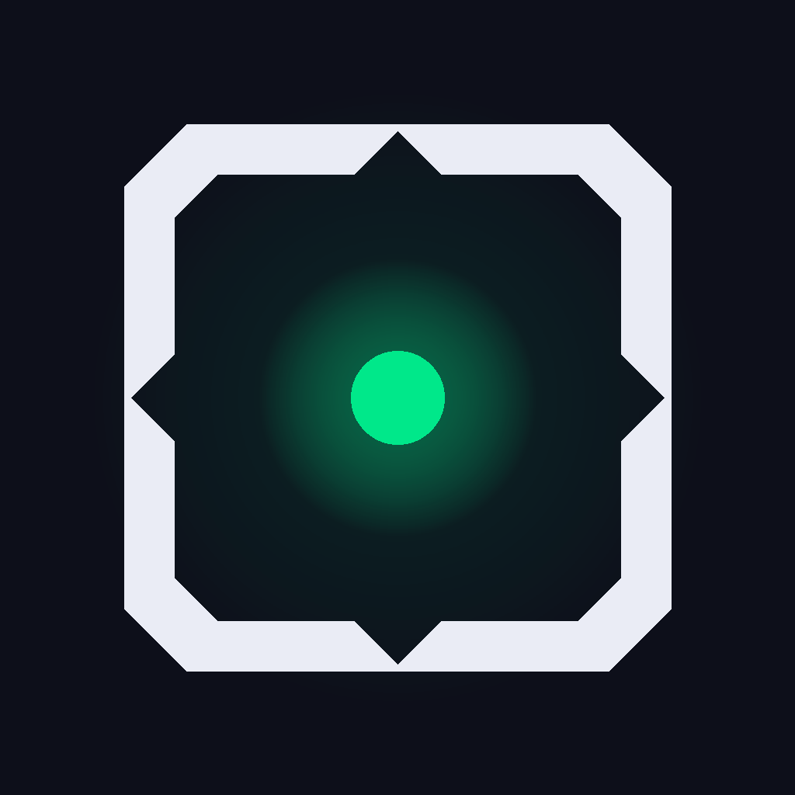
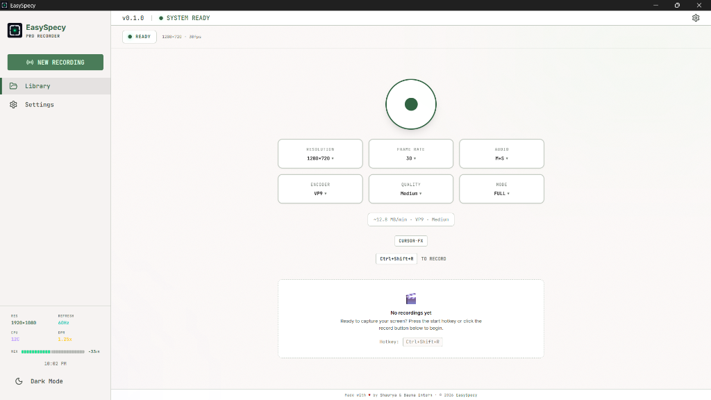
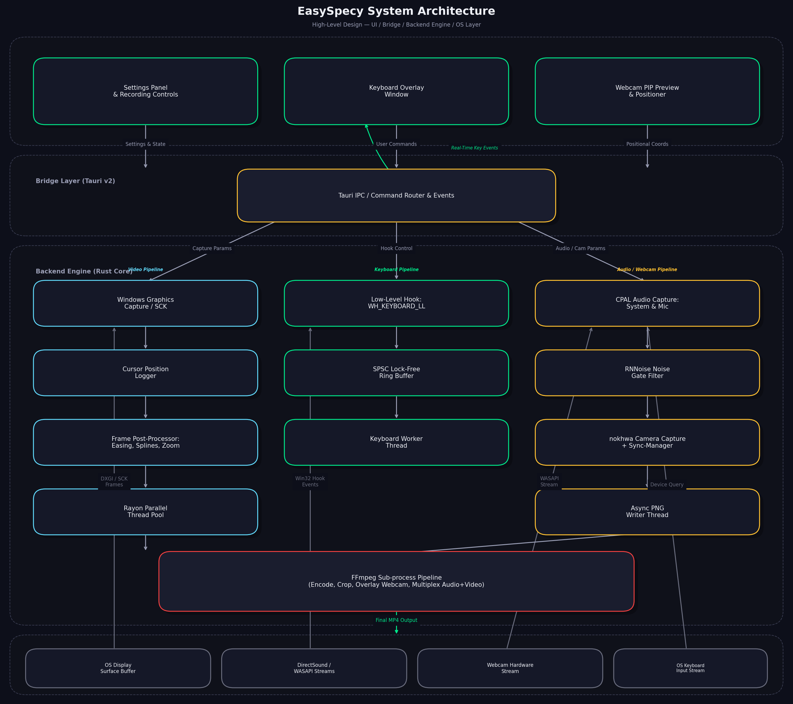

<!-- ═══════════════════════════════════════════════════════
     EASYSPECY — PREMIUM README
     Branded Hero + Bento Layout + System Architecture HLD
     ═══════════════════════════════════════════════════════ -->

<div align="center">
  
  
  <h1>EasySpecy</h1>
  <p><strong>Record like a pro. Pay like it's 2005.</strong></p>
  
  <p style="max-width: 600px; color: #9a9eb5; line-height: 1.6;">
    A free, open-source, high-performance screen recorder for developers, creators, and power users. Captures high-framerate desktop feeds with cinematic auto-zoom, customizable cursor trails, keyboard overlays, and live webcam PIP.
  </p>
</div>

<div align="center" style="margin: 20px 0;">
  <a href="https://github.com/IsNoobgrammer/EasySpecy/releases/latest">
    
  </a>
  <a href="https://github.com/IsNoobgrammer/EasySpecy/releases/latest">
    
  </a>
  <a href="https://isnoobgrammer.github.io/EasySpecy/">
    
  </a>
</div>

<div align="center" style="margin-top: 15px; margin-bottom: 30px;">
  
  
  
  
  <a href="https://isnoobgrammer.github.io/EasySpecy/">
    
  </a>
  
</div>

---

## Interface Preview

Here is how EasySpecy looks in action, displaying the sleek, high-fidelity light-mode interface:

<div align="center">
  
</div>

---

## Bento Feature Showcase

The modular capture layers are represented in our high-end bento architecture:

<div align="center">
  
</div>

---

## High-Level Design (HLD) & System Architecture

EasySpecy is built on a split-architecture model that divides tasks between a web-standard frontend UI and a highly optimized native systems backend.

### Subsystem Flowchart

<div align="center">
  
</div>

### Core Architecture Highlights

1. **Zero-Copy Display Frame Capture**:
   - Rather than scanning memory buffers periodically, the Rust core queries frame updates directly from GPU display surfaces using native system APIs (e.g. `Windows Graphics Capture` on Windows, `ScreenCaptureKit` on macOS).
   - This provides hardware-assisted, sub-millisecond capturing performance, ensuring screen captures remain locked at `60 FPS` even under heavy gaming or CPU rendering loads.

2. **Parallel Frame Post-Processor & Cursor Trails**:
   - The captured display frames undergo a processing pipeline that overlays vector-interpolated cursor trails, click wave ripples, and auto-zoom calculations.
   - These compute-heavy operations are chunked and executed in parallel across a CPU thread pool using `Rayon`. It prevents CPU thread bottlenecks and maintains consistent framerates.

3. **Webcam PIP Overlay**:
   - The facecam feed runs in a dedicated, transparent picture-in-picture viewport.
   - It captures the camera feed natively on the client using the browser's hardware-accelerated Media Devices API. It is overlayed directly as a hardware-composited window, allowing the screen capturer to record it as part of the desktop scene with zero extra rendering lag.

4. **Keyboard Overlay Engine**:
   - Real-time keystrokes are captured using native system-wide listener hooks binded via Tauri.
   - The captured input events are pushed through the IPC bridge, prompting immediate render states inside the overlay component.

5. **High-Performance Audio Pipeline & RNN Filter**:
   - Audio inputs are handled using the `cpal` systems audio interface. The engine captures microphone inputs and loopbacks system audio, converting them to clean single-format PCM audio buffers.
   - The microphone stream is piped directly through `nnnoiseless` (a Rust implementation of Mozilla's `RNNoise` Recurrent Neural Network). The neural network isolates vocal signals and strips out keyboard typing, clicks, and background ambient sounds.

6. **FFmpeg Sub-Process Streaming**:
   - Processed frames (RGBA) and clean audio bytes (PCM) are written directly into an active, low-overhead FFmpeg subprocess pipe.
   - The frames are encoded on the fly (leveraging hardware encoders like H.264 NVENC/AMF/QSV when available) and written to the output file wrapper (`.mp4`), ensuring the video is ready immediately on stop with **zero post-processing delay**.

---

## Platform Support Matrix

| Feature | Windows | macOS | Linux |
|---------|:-------:|:-----:|:-----:|
| **Display Capture (60 FPS)** | Yes (WGC) | Yes (SCK) | Experimental (PipeWire) |
| **Cinematic Auto-Zoom** | Yes (Direct) | No | No |
| **Vector Cursor Trails** | Yes (Direct) | No | No |
| **Keyboard Overlay** | Yes (Tauri Win Hook) | No | No |
| **Webcam Overlay** | Yes (Direct) | Yes (Direct) | Yes (Direct) |
| **RNN Audio Noise Gate** | Yes (RNNoise) | Yes (RNNoise) | Yes (RNNoise) |
| **Hardware Encoding** | Yes (NVENC/AMF) | Yes (VideoToolbox) | Experimental (VAAPI) |

---

## Build from Source

### Prerequisites

Ensure you have the following installed on your machine:
- **Rust Toolchain** (via [rustup](https://rustup.rs/))
- **Node.js v20+** (with `npm`)
- **FFmpeg** (installed and added to your system `PATH`)
- **MSVC Build Tools** (for compiling native Windows bindings)

### Build Steps

1. **Clone the repository**:
   ```bash
   git clone https://github.com/IsNoobgrammer/EasySpecy.git
   cd EasySpecy
   ```

2. **Install frontend dependencies**:
   ```bash
   npm install
   ```

3. **Start the development server (Live Hot Reloading)**:
   ```bash
   npm run tauri dev
   ```

4. **Build the production installer**:
   ```bash
   npm run tauri build
   ```
   The built installer `.exe` will be located under `src-tauri/target/release/bundle/nsis/`.

---

## Additional Resources

- [Full Documentation Site](https://isnoobgrammer.github.io/EasySpecy/) — Detailed configurations and advanced guides.
- [Auto-Zoom Guide](https://isnoobgrammer.github.io/EasySpecy/guide/auto-zoom) — Learn how to tweak easing curves.
- [Contributing Guidelines](https://isnoobgrammer.github.io/EasySpecy/guide/contributing) — Help us make EasySpecy better!

---

<div align="center" style="margin-top: 48px; padding: 24px 0; border-top: 1px solid #2a2d42;">
  <p style="color: #5c6078; font-size: 13px;">
    EasySpecy is built with Rust + Tauri • Maintained by <a href="https://github.com/IsNoobgrammer" style="color: #00e88a; text-decoration: none;">Shaurya</a> • <a href="https://isnoobgrammer.github.io/EasySpecy/" style="color: #00e88a; text-decoration: none;">Documentation</a>
  </p>
  <p style="color: #5c6078; font-size: 11px; margin-top: 4px;">
    Released under the MIT License
  </p>
</div>
