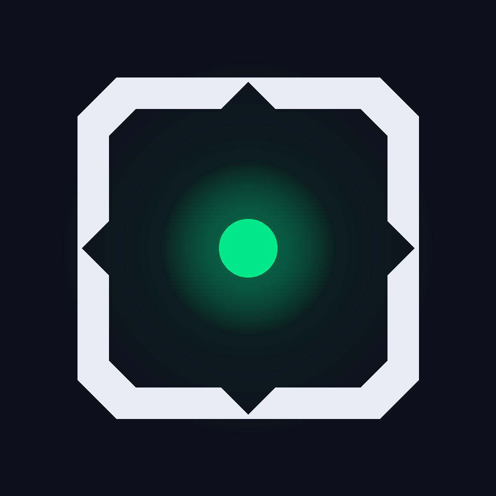
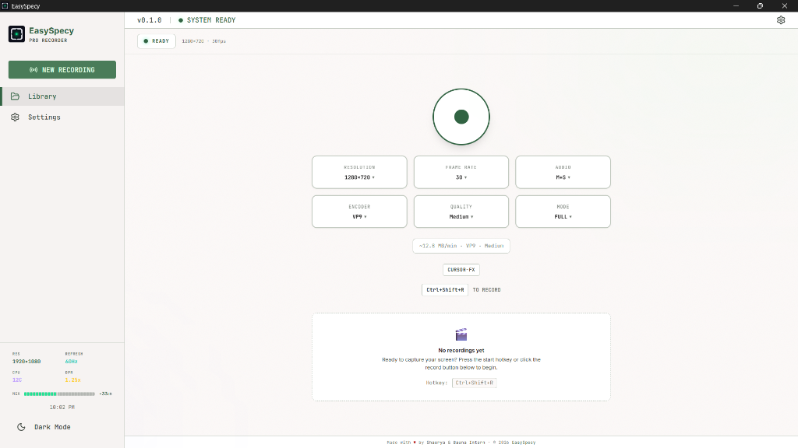
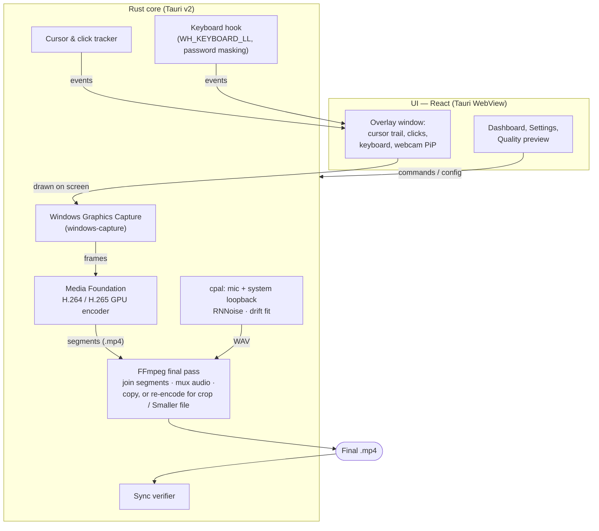

<!-- ═══════════════════════════════════════════════════════
     EASYSPECY — PREMIUM README
     Branded Hero + Bento Layout + System Architecture HLD
     ═══════════════════════════════════════════════════════ -->

<div align="center">
  
  
  <h1>EasySpecy</h1>
  <p><strong>Record like a pro. Pay like it's 2005.</strong></p>
  
  <p style="max-width: 600px; color: #9a9eb5; line-height: 1.6;">
    A free, open-source, high-performance screen recorder for Windows, built for developers, creators and power users. Records your screen with GPU encoding, customizable cursor trails and click effects, a keyboard overlay and a live webcam picture-in-picture, and saves a shareable file in about 2 seconds.
  </p>
</div>

<div align="center" style="margin: 20px 0;">
  <a href="https://github.com/IsNoobgrammer/EasySpecy/releases/latest">
    
  </a>
  <a href="https://github.com/IsNoobgrammer/EasySpecy/releases/latest">
    
  </a>
  <a href="https://isnoobgrammer.github.io/EasySpecy/">
    
  </a>
</div>

<div align="center" style="margin-top: 15px; margin-bottom: 30px;">
  
  
  
  
  <a href="https://isnoobgrammer.github.io/EasySpecy/">
    
  </a>
  
</div>

---

## Interface Preview

Here is how EasySpecy looks in action, displaying the sleek, high-fidelity light-mode interface:

<div align="center">
  
</div>

---

## Bento Feature Showcase

The modular capture layers are represented in our high-end bento architecture:

<div align="center">
  
</div>

---

## High-Level Design (HLD) & System Architecture

EasySpecy is built on a split-architecture model that divides tasks between a web-standard frontend UI and a highly optimized native systems backend.

### Subsystem Flowchart


```mermaid
flowchart TB
  subgraph UI["UI — React (Tauri WebView)"]
    Dash["Dashboard, Settings,<br/>Quality preview"]
    Overlay["Overlay window:<br/>cursor trail, clicks,<br/>keyboard, webcam PiP"]
  end
  subgraph Core["Rust core (Tauri v2)"]
    Cap["Windows Graphics Capture<br/>(windows-capture)"]
    Enc["Media Foundation<br/>H.264 / H.265 GPU encoder"]
    Audio["cpal: mic + system loopback<br/>RNNoise · drift fit"]
    Keys["Keyboard hook<br/>(WH_KEYBOARD_LL, password masking)"]
    Mouse["Cursor & click tracker"]
    Final["FFmpeg final pass<br/>join segments · mux audio ·<br/>copy, or re-encode for crop / Smaller file"]
    Verify["Sync verifier"]
  end
  Dash -- "commands / config" --> Core
  Mouse -- "events" --> Overlay
  Keys -- "events" --> Overlay
  Overlay -- "drawn on screen" --> Cap
  Cap -- "frames" --> Enc
  Enc -- "segments (.mp4)" --> Final
  Audio -- "WAV" --> Final
  Final --> MP4(["Final .mp4"])
  MP4 --> Verify
```

### Core Architecture Highlights

1. **GPU capture with live hardware encoding**:
   - Frames come straight from the compositor through `Windows Graphics Capture` (via the `windows-capture` crate) and go into a Media Foundation hardware encoder (Intel QSV, NVIDIA or AMD, whichever the GPU offers) as H.264 or H.265 while you record.
   - Because the video is already encoded when you press Stop, saving is a stream copy into the final `.mp4`: about 2 s for a 1-minute recording (see [Benchmarks](#benchmarks)).

2. **Live overlays, recorded as part of the screen**:
   - Cursor trails, click ripples, the keyboard overlay and the webcam picture-in-picture are drawn in one transparent, click-through WebView window over the recorded monitor. They're captured exactly as you see them, so there's no extra render pass afterwards.
   - The keyboard overlay uses a low-level Windows keyboard hook. Keys typed into password fields (detected through UI Automation) are shown as `•`.

3. **Audio pipeline with RNN noise reduction**:
   - Microphone and system audio (WASAPI loopback) are captured with `cpal` and started on the same instant as the first video frame. They're fitted to the exact recording length at stop, so long recordings don't drift.
   - The microphone can be cleaned with `nnnoiseless`, a Rust port of the `RNNoise` neural network. It removes steady background noise like fans and hum while keeping voice at full level.

4. **One FFmpeg pass at the end**:
   - The bundled FFmpeg runs once after you stop. It joins pause/resume segments, muxes the audio, and only re-encodes when needed: a region crop, the **Smaller file** option, or AV1/VP9.

5. **Sync verification**:
   - Every recording is checked after saving: video vs. wall-clock length, audio vs. video drift, and start offset. Problems are logged for debugging.

---

## Benchmarks

**Time to save** is from pressing Stop to the file being ready to share. All runs use the defaults, **1080p at 30 fps** and **Medium** quality, with mic + system audio, on an i5-12450H laptop using Intel QSV for live encoding. The test video is real screen content (an editor and a terminal), half still and half scrolling. Scrolling is the hardest case for file size.

**Main choices on the dashboard**

| Output | Time to save (1 min) | Time to save (2 min) | Size per minute |
|---|---|---|---|
| **H.264** (default, plays everywhere) | ~2 s | ~3 s | ~24 MB |
| **H.265** (~25% smaller, newer players) | ~1.5 s | ~3 s | ~18 MB |
| **H.264 + Smaller file** | ~9 s | ~20 s | **~5.5 MB** |
| **H.265 + Smaller file** | ~10 s | ~19 s | **~5.5 MB** |
| H.264 with a pause/resume | ~1.5 s | ~3 s | ~24 MB |

H.264 and H.265 save almost instantly because the video is already encoded on the GPU while you record. Saving just copies it into the final file. **Smaller file** re-encodes after you stop: the file is about 4× smaller, but saving takes longer, roughly 9–10 s per minute of video. It always outputs H.264, which comes out the same size as H.265 for screen content but encodes much faster and plays everywhere.

**Quality presets** (live encoder, video only, per minute at 1080p30)

| Quality | H.264 | H.265 |
|---|---|---|
| Low | ~13 MB | ~10 MB |
| **Medium** (default) | ~22 MB | ~17 MB |
| High | ~36 MB | ~27 MB |
| Ultra | ~53 MB | ~40 MB |

Use **Compare quality** in the app to see each one on your own screen before choosing.

**Advanced encoders** (Settings → Video encoder; these always re-encode)

| Output | Time to save (1 min) | Time to save (2 min) | Size per minute |
|---|---|---|---|
| AV1 (CPU, SVT-AV1) | ~21 s | ~45 s | ~5 MB |
| VP9 (CPU) | ~17 s | ~26 s | ~15 MB |
| Region / window crop 1280×720, H.264 | ~5 s | ~10 s | ~3.9 MB |
| Region / window crop 1280×720, H.265 | ~12 s | ~27 s | ~3.6 MB |

- **NVENC H.264/H.265:** saves just as fast as H.264/H.265 above, because live capture already produced the video.
- **AV1 NVENC:** needs an RTX 40-series GPU.
- **Smaller file and crop sizes depend on content.** A mostly still screen comes out smaller.

**While recording**, with cursor trail + webcam + keyboard overlay all on, the app uses about **65% of one CPU core** with the mouse moving and **~49%** when it's still. Most of that is Windows' own Media Foundation encoder.

<sub>Reproduce: `cargo run --release --example bench_post -- <intermediates> <out>` in `src-tauri` (see `examples/bench_post.rs`). It runs the app's real save pass over pre-encoded clips, so no re-recording is needed.</sub>

---

## System Requirements

| | |
|---|---|
| **OS** | Windows 10 version 2004 (May 2020 Update) or later, or Windows 11; 64-bit |
| **macOS / Linux** | Not supported. Capture, encoding, the keyboard hook and cursor packs all use Windows-only APIs |
| **GPU** | Any GPU with a hardware video encoder (Intel, NVIDIA or AMD). H.265 needs a GPU and Windows install that provide an HEVC encoder; EasySpecy falls back to H.264 if not |
| **FFmpeg** | Bundled with the installer, nothing to install |

**Windows 10 notes**
- **Yellow border:** Windows 10 draws a yellow border around the screen while it's being recorded, and apps can't turn it off there.
- **Frame rate:** Windows 10 delivers frames at up to the monitor's refresh rate, and EasySpecy keeps only the frame rate you chose. Windows 11 caps capture at that rate itself.
- **"N" editions** (sold in Europe without media features) need Microsoft's free **Media Feature Pack** for the video encoder.
- **Portable ZIP:** it needs the Microsoft Edge WebView2 Runtime, which most Windows 10 PCs already have. The installer adds it automatically if it's missing.

---

## Build from Source

### Prerequisites

Ensure you have the following installed on your machine:
- **Rust Toolchain** (via [rustup](https://rustup.rs/))
- **Node.js v20+** (with `npm`)
- **FFmpeg**: put `ffmpeg.exe` in `src-tauri/resources/` so it gets bundled (the release workflow downloads the [gyan.dev essentials build](https://www.gyan.dev/ffmpeg/builds/)). For `npm run tauri dev`, an `ffmpeg` on your `PATH` also works
- **MSVC Build Tools** (for compiling native Windows bindings)

### Build Steps

1. **Clone the repository**:
   ```bash
   git clone https://github.com/IsNoobgrammer/EasySpecy.git
   cd EasySpecy
   ```

2. **Install frontend dependencies**:
   ```bash
   npm install
   ```

3. **Start the development server (Live Hot Reloading)**:
   ```bash
   npm run tauri dev
   ```

4. **Build the production installer**:
   ```bash
   npm run tauri build
   ```
   The built installer `.exe` will be located under `src-tauri/target/release/bundle/nsis/`.

---

## Additional Resources

- [Full Documentation Site](https://isnoobgrammer.github.io/EasySpecy/) — Detailed configurations and advanced guides.
- [Contributing Guidelines](https://isnoobgrammer.github.io/EasySpecy/guide/contributing) — Help us make EasySpecy better!

---

<div align="center" style="margin-top: 48px; padding: 24px 0; border-top: 1px solid #2a2d42;">
  <p style="color: #5c6078; font-size: 13px;">
    EasySpecy is built with Rust + Tauri • Maintained by <a href="https://github.com/IsNoobgrammer" style="color: #00e88a; text-decoration: none;">Shaurya</a> • <a href="https://isnoobgrammer.github.io/EasySpecy/" style="color: #00e88a; text-decoration: none;">Documentation</a>
  </p>
  <p style="color: #5c6078; font-size: 11px; margin-top: 4px;">
    Released under the MIT License
  </p>
</div>
