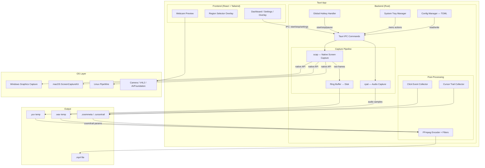
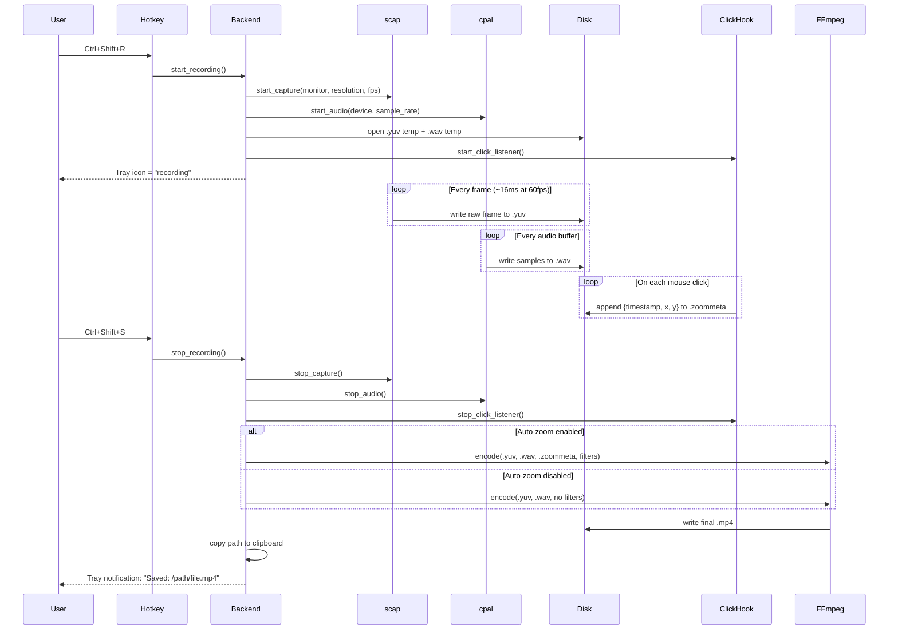
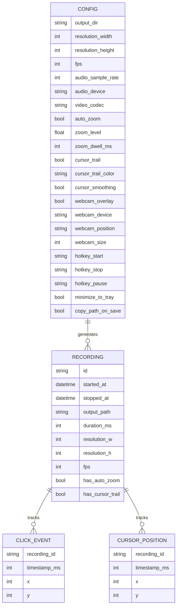

# EasySpecy — Architecture Document

**Version:** 1.0
**Date:** 2026-05-31

---

## 1. System Diagram

---

## 2. Component Responsibilities

| Component | Owns | Does NOT Own |
|-----------|------|-------------|
| scap | Screen frame capture, monitor enumeration | Encoding, file I/O |
| cpal | Audio stream capture, sample rate conversion | File writing |
| FFmpeg | Video encoding, filter application | Frame capture, UI |
| Hotkey | System-wide key registration | Recording logic |
| Tray | Icon, menu, notification | Recording state |
| Config | Settings read/write, defaults | Validation (frontend does this) |
| Post-Process | Auto-zoom metadata, cursor trail data, FFmpeg invocation | Frame capture |
| Dashboard | User interaction, settings UI | Recording logic |
| Overlay | Minimal recording UI (timer, stop) | Full settings |

---

## 3. Critical User Flow — Record with Auto-Zoom

---

## 4. Data Model

---

## 5. Deployment Topology

| Platform | Bundle Format | Screen Capture API | Audio API | Camera API |
|----------|--------------|-------------------|-----------|------------|
| Windows 10+ | .msi / .exe (NSIS) | Windows.Graphics.Capture | WASAPI | DirectShow |
| macOS 12+ | .dmg / .app | ScreenCaptureKit | CoreAudio | AVFoundation |
| Linux (X11/Wayland) | .AppImage / .deb | PipeWire | ALSA/PulseAudio | V4L2 |

**FFmpeg bundling:**
- Windows: Ship `ffmpeg.exe` in resources/
- macOS: Ship `ffmpeg` universal binary in app bundle
- Linux: Ship `ffmpeg` static build or depend on system package

---

## 6. External Dependencies

| Dependency | Purpose | Fallback if Unavailable |
|------------|---------|------------------------|
| scap | Screen capture | None — core dependency, must compile |
| cpal | Audio capture | Record video-only if no audio device |
| FFmpeg | Encoding + filters | None — core dependency, must bundle |
| tauri-plugin-global-shortcut | Hotkeys | Disable hotkeys, use GUI-only controls |
| tauri-plugin-tray | System tray | Run as normal window, no tray |

---

## 7. Failure Modes & Mitigations

| Failure | Impact | Mitigation |
|---------|--------|------------|
| scap capture drops frames | Video stutter | Log dropped frames, warn user to lower resolution |
| Disk full during recording | Recording lost | Monitor free space, auto-stop at 100MB remaining, save partial |
| FFmpeg not found at runtime | Cannot encode | Check on startup, show download prompt |
| Hotkey registration fails | No keyboard control | Show error in settings, allow reassignment |
| Camera in use by another app | No webcam overlay | Show "camera busy" warning, continue without webcam |
| Audio device disconnected mid-recording | Silent audio | Detect disconnect, switch to no-audio or show warning |
