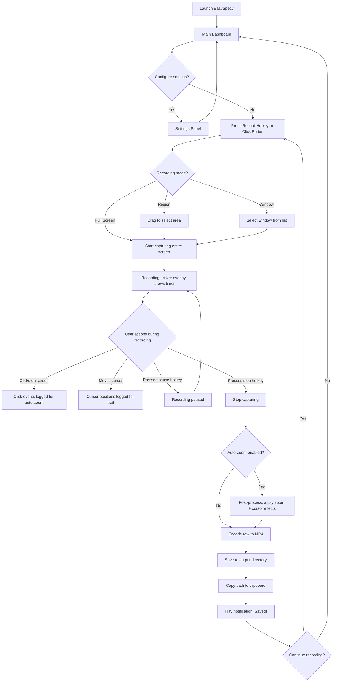
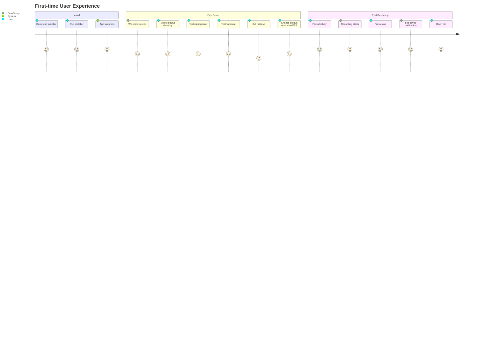

# EasySpecy — User Flow Document

**Version:** 1.0
**Date:** 2026-05-31

---

## 1. Primary User Journey: Record a Demo

---

## 2. Onboarding Flow

---

## 3. Edge Cases & Error States

| Scenario | User Sees | System Does |
|----------|-----------|-------------|
| No webcam connected | Webcam toggle greyed out, tooltip: "No camera detected" | Disables webcam overlay, continues without |
| Mic unplugged mid-record | Tray warning: "Audio device lost" | Continues video-only, marks file as no-audio |
| Disk fills up during record | Tray notification: "Low disk space, stopping" | Auto-stops, saves partial recording |
| Hotkey conflicts with another app | Settings: "Hotkey unavailable, choose another" | Rejects binding, keeps previous |
| User closes window while recording | App minimizes to tray, recording continues | Tray shows recording state |
| FFmpeg encoding fails | Toast: "Encoding failed, raw file saved at..." | Preserves raw .yuv + .wav, offers manual encode |
| 0-second recording (accidental) | Silently discarded, no file saved | Cleanup temp files, no notification |
| Region select cancelled (Escape) | Returns to dashboard | No recording started |
| Multiple monitors | Settings: "Select monitor" dropdown | Enumerates via scap, user picks one |

---

## 4. Screen Inventory

| Screen | Route | Auth | Description |
|--------|-------|------|-------------|
| Dashboard | `/` | None | Main view: record button, recent recordings, quick settings |
| Settings | `/settings` | None | All configuration options |
| Recording Overlay | Floating window | None | Minimal timer + stop button during recording |
| Region Selector | Fullscreen overlay | None | Transparent overlay for drag-to-select |
| Webcam Config | `/settings/webcam` | None | Webcam device selection, preview, position/size |
| About | `/about` | None | Version, license, links |
