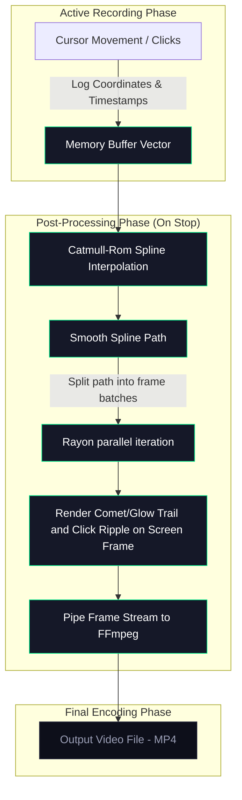

# Cursor Settings

Complete guide to cursor customization, trail effects, and click animations in EasySpecy.

---

## Overview

EasySpecy provides professional cursor customization with two independent systems:

1. **Cursor Packs** — Replace your system cursor with custom designs during recording
2. **Cursor Trails** — Render smooth, animated trails behind the cursor in post-processing

Both systems can be used simultaneously or independently.

---

## Cursor Packs

Cursor packs replace your Windows system cursor with custom `.cur` files during recording. The original cursor is automatically restored when recording stops.

### Available Packs

| Pack | Description | Author |
|------|-------------|--------|
| **System Default** | No change — uses your Windows cursor | Windows |
| **macOS** | Apple's cursor with shadow — clean and iconic | Community |
| **Posy's Improved** | Crisp black with white border — the internet's favorite | Michiel de Boer |
| **Specy Classic** | Clean capture layout with green accents | EasySpecy |
| **Specy's Glasses** | Glassmorphic body with glowing indicators and holographic rings | EasySpecy |

### How Packs Work

Each pack contains 10 cursor types:
- Arrow (normal pointer)
- I-Beam (text selection)
- Hand (links)
- Cross (precision)
- Size We/Ns/NwSe/NeSw (resize handles)
- Size All (move)
- No (forbidden)

During recording, EasySpecy calls `SetSystemCursor` to replace all cursor types. When recording stops, `SystemParametersInfo(SPI_SETCURSORS)` restores the original cursors.

### Configuration

```toml
# In config.toml
cursor_pack = "default"  # default, macos, posy, specy_classic, easyspecy
```

### Custom Packs

Create your own cursor pack:

1. Create a folder in `%APPDATA%\easyspecy\cursors\your-pack-name\`
2. Add `.cur` files with these names (any subset):
   - `arrow.cur`, `normal.cur`, or `default.cur` (required)
   - `ibeam.cur`, `text.cur`, `beam.cur`
   - `hand.cur`, `link.cur`
   - `cross.cur`
   - `sizewe.cur`
   - `sizens.cur`
   - `sizenwse.cur`
   - `sizenesw.cur`
   - `sizeall.cur`, `move.cur`
   - `no.cur`, `forbidden.cur`

3. EasySpecy will automatically detect the pack and list it in settings

### Platform Support

Cursor packs are **Windows-only**. The pack system uses `SetSystemCursor` from the Windows API, which is not available on macOS or Linux.

---

## Cursor Trails

Cursor trails render a smooth, animated path behind the cursor position. Trails are added during post-processing, not live—so there's zero performance impact during recording.

### Trail Styles

| Style | Description | Visual |
|-------|-------------|--------|
| **Glow** | Soft glow around cursor path with fading opacity | Luminous, subtle |
| **Comet** | Bright head at cursor, fading tail behind | Meteor-like |
| **Rainbow** | HSL color cycling along the trail | Vibrant, colorful |
| **Classic** | Simple solid line with configurable color | Minimal, clean |

### Trail Rendering Architecture

Trails use a **post-processing approach** to guarantee zero impact on capture performance:



The pipeline operates in three phases:
1. **Log**: During recording, cursor positions and click events are stored in a lock-free memory vector, consuming negligible CPU.
2. **Smooth**: When recording stops, a Catmull-Rom spline interpolates missing points between samples to ensure gap-free motion.
3. **Render**: The trail and click effects (ripple, pulse, explosion) are parallel-rendered across CPU cores using `rayon` and piped directly to FFmpeg.

### Configuration

```toml
# Enable trails
cursor_trail_enabled = true

# Trail appearance
trail_style = "glow"              # glow, comet, rainbow, classic
cursor_trail_color = "#00ff88"    # Primary color (glow, classic, rainbow start)
cursor_secondary_color = "#ff4488" # Secondary color (right-click, gradients, rainbow end)
cursor_trail_size = 1.0           # Trail width multiplier (0.5 - 2.0)
cursor_smoothing = true           # Catmull-Rom spline interpolation
cursor_size_multiplier = 1.0      # Cursor scale (0.5 - 2.0)
```

### Trail Colors

- **Glow**: `cursor_trail_color` defines the glow color
- **Comet**: `cursor_trail_color` for head, fades to transparent
- **Rainbow**: Gradient from `cursor_trail_color` to `cursor_secondary_color`
- **Classic**: Solid `cursor_trail_color`

### Smoothing

When `cursor_smoothing = true`, EasySpecy applies a **Catmull-Rom spline** to the entire cursor path before rendering any frames. This produces:
- No jitter or gaps
- Natural, fluid motion
- Consistent trail width

Disabling smoothing renders raw cursor positions—useful for precise, pixel-level accuracy but may appear jagged.

---

## Click Effects

Click effects render an animation at the cursor position when you click.

### Available Effects

| Effect | Description |
|--------|-------------|
| **Ripple** | Expanding circle that fades out (default) |
| **Pulse** | Quick scale-up and fade |
| **Explosion** | Particle burst effect |
| **None** | No click effect |

### Configuration

```toml
click_effect = "ripple"  # ripple, pulse, explosion, none
```

---

## Performance Impact

### During Recording
- **Cursor packs**: Negligible (one-time `SetSystemCursor` call)
- **Trail logging**: Minimal (appending to in-memory vector)
- **Total overhead**: < 1% CPU

### Post-Processing
- **Trail rendering**: CPU-bound, parallelized across all cores
- **Typical time**: 1-3× real-time (depends on trail length and video duration)
- **Memory**: ~200 MB for 10-minute recording at 1080p60

### Optimization Tips
- Use `cursor_smoothing = false` for faster rendering (lower quality)
- Reduce `cursor_trail_size` for less GPU work in FFmpeg
- Use shorter recordings if post-processing is too slow

---

## Troubleshooting

### Trail has gaps or appears jagged
- Enable `cursor_smoothing = true`
- Increase capture FPS (higher sample rate = smoother path)
- Check if another app is modifying cursor position

### Cursor pack not applying
- Verify you're on Windows (packs are Windows-only)
- Check `%APPDATA%\easyspecy\logs\easyspecy.log` for errors
- Ensure `.cur` files are valid Windows cursor files

### Cursor not restored after recording
- EasySpecy automatically restores on stop
- If recording crashes, restart EasySpecy to restore cursors
- Manual restore: `SystemParametersInfo(SPI_SETCURSORS)` via PowerShell

### Rainbow trail looks wrong
- Verify both `cursor_trail_color` and `cursor_secondary_color` are set
- Use hex format: `#RRGGBB`

---

## Advanced: Trail Rendering Pipeline

For developers interested in the implementation:

```rust
// 1. Collect cursor samples during recording
struct CursorSample {
    x: f32,
    y: f32,
    timestamp_ms: f64,
    click: Option<ClickType>, // Left, Right, Double
}

// 2. Post-recording: pre-smooth entire path
let smoothed = catmull_rom_spline(&samples, interpolation_factor);

// 3. Pre-compute trail segments in parallel
let segments: Vec<TrailSegment> = smoothed.par_iter()
    .map(|sample| compute_trail_segment(sample, config))
    .collect();

// 4. Batch-render frames (2x CPU cores)
let batches: Vec<_> = frames.chunks(num_cores * 2).collect();
batches.par_iter().for_each(|batch| {
    for frame in batch {
        render_trail_onto_frame(frame, &segments, config);
    }
});

// 5. Pipe to FFmpeg in order
Command::new(ffmpeg)
    .args(["-i", "frames/%06d.png", "-c:v", "libx264", "output.mp4"])
    .output()?;
```

The trail system is designed for **maximum quality with minimum impact on recording performance**. All heavy computation happens after recording stops.
