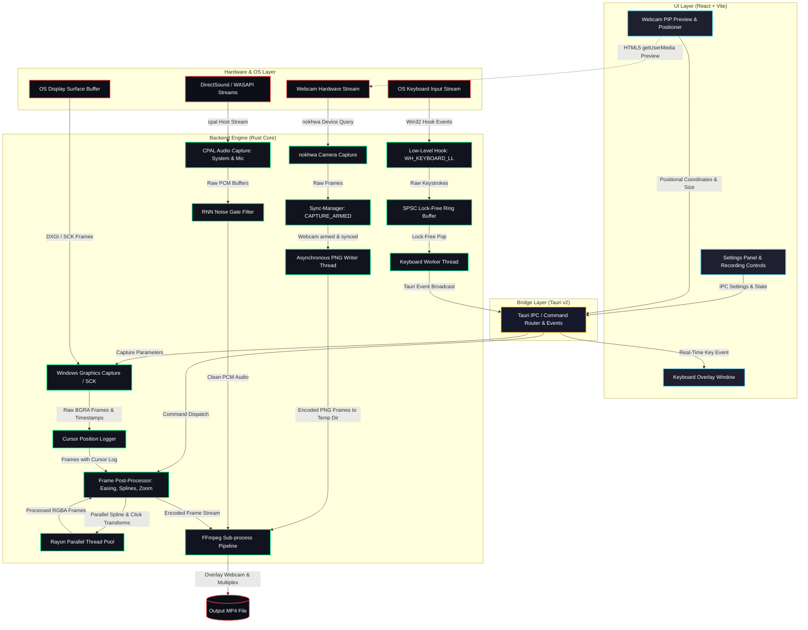

# Introduction

**EasySpecy** is a free, open-source screen recorder for Windows that delivers cinematic auto-zoom, cursor effects, keyboard overlay, and webcam compositing — the kind you'd expect from $89/year software like Screen Studio, but completely free.

**Platforms:** Windows (primary), macOS/Linux (experimental — basic capture only)

## What is EasySpecy?

EasySpecy exists because screen recording shouldn't cost a subscription. It shouldn't be locked to one OS. And it shouldn't require a PhD in OBS settings to get polished results.

Built with **Rust** and **Tauri 2**, EasySpecy handles all performance-critical work (capture, encoding, effects) in native code. The React frontend is a thin GUI layer. FFmpeg is bundled for encoding and post-processing.

## Why EasySpecy?

### The Problem

Screen recording tools fall into two camps:

1. **Simple but limited** — Basic capture, no post-processing, ugly output
2. **Powerful but expensive** — Screen Studio ($89/year, macOS only), Camtasia ($179), Adobe Premiere ($20/month)

There's no free, cross-platform tool that gives you **cinematic output out of the box**.

### The Solution

EasySpecy bridges that gap:

| Feature | EasySpecy | OBS | Screen Studio |
|---------|-----------|-----|---------------|
| **Price** | Free | Free | $89/year |
| **Windows Support** | Full | Full | Not available |
| **Auto-zoom** | ✅ | ❌ | ✅ |
| **Cursor effects** | ✅ | ❌ | ✅ |
| **Keyboard overlay** | ✅ | ❌ | ❌ |
| **Webcam overlay** | ✅ | ✅ | ✅ |
| **Bundle size** | ~3MB | ~200MB | ~150MB |
| **Learning curve** | Low | High | Low |
| **Open source** | ✅ (MIT) | ✅ (GPL) | ❌ |

## Core Features

### Cinematic Auto-Zoom

Automatically zooms toward your click positions during post-processing. Uses click detection heuristics to identify intentional clicks vs accidental movements, then smoothly animates zoom toward that position.

**Status:** In active development

### Cursor Effects & Trails

Beautiful cursor trails rendered with:
- **Catmull-Rom spline** smoothing for silky-smooth paths
- **Comet model** — bright head at cursor position, fading tail behind
- **Parallel rendering** via `rayon` for maximum performance
- **5 cursor packs** — System, macOS, Posy, Specy Classic, Specy's Glasses
- **Click effects** — Ripple, spark, and impact animations

**Status:** Complete

### Keyboard Overlay

Global keyboard capture showing pressed keys in real-time:
- **WH_KEYBOARD_LL hook** for system-wide key detection
- **SPSC lock-free ring buffer** (1024 entries, zero allocations)
- **4 themes** — Speccy's Classic, Light Glassmorphism, Neon Green, Neon Purple
- **Game capture support** — Admin elevation for anti-cheat games
- **Bubble system** — Active vs sealed key displays
- **Unicode key mappings** — ⌃ ⌥ ⇧ ⊞ ↵ ⌫ ␣ ⎋

**Status:** Complete

### Webcam Overlay

Picture-in-picture webcam recording:
- **Sync-manager pattern** — syncs to video/audio via CAPTURE_ARMED
- **Resizable and repositionable** — 4 corners + custom positioning
- **Real-time enhancements** — Sharpen, Brightness, Contrast controls
- **Circle/rectangle shapes** with customizable borders
- **Composited into final video** via FFmpeg (not live overlay)
- Uses `nokhwa` for cross-platform webcam capture

**Status:** Complete

### Dual Audio Recording

Record **microphone + system audio** simultaneously:
- WASAPI shared mode (Windows) — doesn't lock mic exclusively
- Configurable noise gate + spectral subtraction
- RNN noise reduction via `nnnoiseless` crate
- Mic gain, system volume, noise reduction all user-adjustable
- Real-time level metering in UI

**Status:** Complete

### Native Performance

- **Rust backend** — memory-safe, zero-cost abstractions
- **Tauri 2** — ~3MB bundle (vs 100MB+ for Electron)
- **Sub-50ms capture latency** on Windows
- **Parallel post-processing** — rayon-based frame rendering
- **Batch processing** — 2x CPU cores for frame rendering

### Privacy-First

- **Fully offline** — no internet connection required
- **No telemetry** — we don't collect anything
- **No accounts** — no sign-up, no login
- **Local storage** — recordings saved to your configured output directory

### Region Selection

- **Full screen** — capture entire monitor
- **Window capture** — select specific application window
- **Region capture** — drag to select custom area
- **Live preview** — see selection in real-time

## Architecture

EasySpecy uses a layered architecture with clear separation of concerns:

### Subsystem Flowchart

### Module Breakdown

**Frontend (React):**
- Dashboard with recording controls
- Settings panel for all configuration
- Region selector with live preview
- Recording overlay with audio monitoring
- Webcam preview with positioning

**Backend (Rust):**
- `capture/` — Windows Graphics Capture API, frame handling, region cropping
- `audio/` — WASAPI capture (mic + system), RNN noise reduction, spectral subtraction
- `postprocess/` — FFmpeg orchestration, auto-zoom compositing, cursor trail rendering
- `cursors/` — Cursor pack system with 5 themes
- `webcam/` — Cross-platform webcam capture via nokhwa
- `keyboard/` — Global keyboard hook with SPSC queue
- `autozoom/` — Click detection heuristics, zoom filter generation
- `config/` — TOML configuration (90+ fields)

**Communication:**
- Tauri IPC bridge (28 commands)
- Async commands for non-blocking operations
- Event system for real-time updates

## Current Status

**Phase 3 — Final Polish**

**Completed Features:**
- [x] Screen/region/window capture (Windows Graphics Capture API)
- [x] Audio recording (mic + system with noise reduction)
- [x] Cursor effects (trails, smoothing, 5 packs, click effects)
- [x] Keyboard overlay (global hook, 4 themes, game capture)
- [x] Webcam overlay (sync-manager, positioning, enhancements)
- [x] System tray integration
- [x] Hotkey configuration
- [x] Recording history
- [x] Region selection with live preview

**In Development:**
- [ ] Auto-zoom (click detection heuristics, FFmpeg zoompan filters)

**Planned:**
- [ ] Live streaming support (RTMP/YouTube/Twitch)

## Who is EasySpecy For?

### Target Audience

- **Developers** recording tutorials, demos, or bug reports
- **Creators** making YouTube videos, course content, or social media
- **Educators** recording lectures or presentations
- **Anyone** who wants polished recordings without paying subscriptions

### Non-Target Use Cases

- **Live streaming** — EasySpecy records to file, not streams
- **Enterprise deployment** — No centralized management (yet)
- **Cloud collaboration** — Fully offline, no sharing features

## Next Steps

- [Installation](/guide/installation) — Get EasySpecy running on your system
- [Quick Start](/guide/quick-start) — Record your first video in 5 minutes
- [Core Features](/guide/screen-capture) — Learn about capture modes, audio, and effects

## Community

- **GitHub:** [IsNoobgrammer/EasySpecy](https://github.com/IsNoobgrammer/EasySpecy)
- **Issues:** [Report bugs or request features](https://github.com/IsNoobgrammer/EasySpecy/issues)
- **License:** [MIT](https://github.com/IsNoobgrammer/EasySpecy/blob/master/LICENSE)

---

**Ready to start?** → [Installation Guide](/guide/installation)
