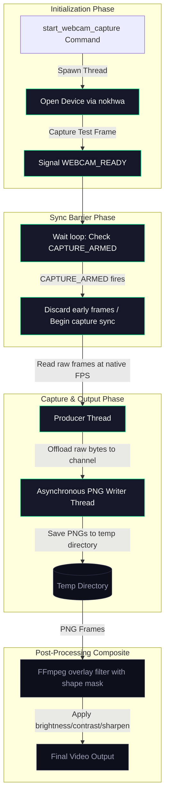

# Webcam Settings

Guide to webcam overlay configuration, positioning, and real-time enhancements in EasySpecy.

---

## Overview

EasySpecy's webcam overlay records a picture-in-picture (PiP) webcam feed composited onto your screen recording. The overlay supports customizable positioning, shapes, borders, and real-time video enhancements.

---

## Architecture

Webcam capture uses a **sync-manager pattern** with producer-consumer design:



The capture engine works in four distinct phases:
1. **Initialization**: The camera device is opened and verified by capturing a test frame before signaling that the camera is ready.
2. **Sync Barrier**: The capture loop discards early frames until the recording starts globally and `CAPTURE_ARMED` fires, synchronizing audio, video, and webcam to frame 0.
3. **Capture & I/O**: The producer thread captures frames at native FPS and sends raw bytes to an asynchronous consumer thread to avoid I/O bottlenecks.
4. **Compositing**: In post-processing, FFmpeg applies shapes (circle/rectangle), borders, and image enhancements (sharpen, brightness, contrast) before rendering onto the main recording.

### Synchronization

Webcam frames are synchronized to video frame 0:
- Camera opens before recording starts
- Frames are captured but discarded until `CAPTURE_ARMED` fires
- First webcam frame timestamp = first video frame timestamp
- Guarantee: webcam, video, and audio start at the exact same instant

---

## Configuration

### Basic Settings

```toml
# Enable webcam
webcam_enabled = true

# Device selection (empty = default device)
webcam_device = "Logitech C920"

# Position (4 corners or custom)
webcam_position = "BottomRight"  # TopLeft, TopRight, BottomLeft, BottomRight, Custom

# Size (width in pixels)
webcam_size = 240  # 160, 240, 320, 480

# Shape
webcam_shape = "Circle"  # Circle, Rectangle

# Border
webcam_border_color = "#00e88a"
webcam_border_width = 3

# Opacity (0.0 = transparent, 1.0 = opaque)
webcam_opacity = 1.0
```

### Custom Positioning

When `webcam_position = "Custom"`, use coordinates:

```toml
webcam_x = 1500  # X position (pixels from left)
webcam_y = 800   # Y position (pixels from top)
```

Coordinates are relative to the recording resolution, not screen resolution.

---

## Positioning Guide

### Preset Positions

| Position | Description | Use Case |
|----------|-------------|----------|
| **TopLeft** | Top-left corner, 20px margin | Minimal intrusion, good for UI demos |
| **TopRight** | Top-right corner, 20px margin | Standard for tutorials |
| **BottomLeft** | Bottom-left corner, 20px margin | Alternative to TopRight |
| **BottomRight** | Bottom-right corner, 20px margin | Default, least obtrusive |

### Custom Positioning

1. Enable webcam in settings
2. Open the webcam preview panel
3. Drag the overlay to desired position
4. EasySpecy automatically calculates `webcam_x` and `webcam_y`
5. Coordinates are clamped to stay within recording boundaries

### Position Calculation

EasySpecy ensures the webcam stays within the recording area:
```
x = max(0, min(recording_width - webcam_width, x))
y = max(0, min(recording_height - webcam_height, y))
```

---

## Shapes & Borders

### Circle Shape

- Webcam feed is cropped to a circle using FFmpeg `geq` filter
- Border renders as a ring around the circle
- Best for: Tutorials, reaction videos, professional presentations

### Rectangle Shape

- Webcam feed is rectangular with rounded corners
- Border renders as a rectangle outline
- Best for: Gaming, casual content, showing more of the background

### Border Customization

```toml
webcam_border_color = "#00e88a"  # Hex color or rgba()
webcam_border_width = 3          # Pixels (0 = no border)
```

**Popular border colors:**
- EasySpecy green: `#00e88a`
- White: `#ffffff`
- Black: `#000000`
- Transparent: `webcam_border_width = 0`

---

## Video Enhancements

EasySpecy applies real-time enhancements to webcam frames before compositing.

### Sharpen

```toml
webcam_sharpen = 0.3  # 0.0 (off) to 1.0 (max)
```

Enhances edge definition using unsharp mask filter:
- `0.0`: No sharpening (soft image)
- `0.3`: Subtle enhancement (recommended)
- `0.5-0.7`: Noticeable sharpening
- `1.0`: Maximum (may introduce artifacts)

### Brightness

```toml
webcam_brightness = 5  # -50 to 50
```

Adjusts frame brightness:
- `-50`: Darkest
- `0`: No change
- `5`: Slight brightening (recommended for poor lighting)
- `50`: Brightest

### Contrast

```toml
webcam_contrast = 1.1  # 0.5 to 2.0
```

Multiplies contrast:
- `0.5`: Low contrast (flat)
- `1.0`: No change
- `1.1`: Slight enhancement (recommended)
- `2.0`: High contrast (dramatic)

### Enhancement Pipeline

Enhancements are applied via FFmpeg filters in this order:
```
Raw Frame → Brightness → Contrast → Sharpen → Composite
```

---

## FFmpeg Compositing

Webcam is composited onto video using FFmpeg's `overlay` filter:

### Circle Shape
```bash
ffmpeg -i video.mp4 -i webcam_frames/ \
  -filter_complex "
    [1:v]fps=30,format=rgba,geq='if(lt(pow(X-W/2,2)+pow(Y-H/2,2),pow(min(W,H)/2,2)),pixval(X,Y),0)',
    drawbox=x=0:y=0:w=W:h=H:color=#00e88a@0.5:width=3[webcam];
    [0:v][webcam]overlay=W-w-20:H-h-20[out]
  " \
  -map "[out]" output.mp4
```

### Rectangle Shape
```bash
ffmpeg -i video.mp4 -i webcam_frames/ \
  -filter_complex "
    [1:v]fps=30,format=rgba,drawbox=x=0:y=0:w=W:h=H:color=#00e88a@0.5:width=3[webcam];
    [0:v][webcam]overlay=W-w-20:H-h-20[out]
  " \
  -map "[out]" output.mp4
```

The overlay position (`W-w-20:H-h-20`) is calculated from `webcam_position` or custom coordinates.

---

## Device Selection

### Listing Devices

EasySpecy enumerates cameras via `nokhwa`:

```rust
let cameras = nokhwa::query(nokhwa::ApiBackend::Auto)
    .map_err(|e| e.to_string())?;
```

The frontend displays available devices in a dropdown.

### Default Device

If `webcam_device = ""` (empty string), EasySpecy uses the system default camera.

### Multiple Cameras

If you have multiple cameras:
1. Open Settings → Webcam
2. Select device from dropdown
3. Preview updates automatically
4. Save settings

### Troubleshooting Devices

**Camera not showing in list:**
- Check if another app is using the camera (Zoom, Teams, Discord)
- Try closing other apps and restarting EasySpecy
- Verify camera works in Windows Camera app

**Camera opens but shows black screen:**
- Check physical camera cover/privacy shutter
- Verify camera permissions in Windows Settings → Privacy → Camera
- Try a different USB port (for external cameras)

---

## Performance

### During Recording
- **Capture thread**: Runs at native camera FPS (typically 30 or 60)
- **Writer thread**: Encodes frames to PNG asynchronously
- **Memory**: ~50-100 MB (depends on webcam resolution)
- **CPU**: 2-5% (PNG encoding is CPU-bound)

### Post-Processing
- **Compositing time**: 1-2× real-time (depends on webcam size and video duration)
- **Enhancement filters**: Add 10-20% to compositing time

### Optimization Tips
- Use smaller `webcam_size` (160 or 240) for faster processing
- Disable enhancements (`sharpen = 0`, `brightness = 0`, `contrast = 1.0`) if not needed
- Close other apps using the camera to prevent resource contention

---

## Preview & Testing

### Live Preview

EasySpecy provides a live webcam preview in the settings panel:
1. Open Settings → Webcam
2. Enable webcam
3. Preview shows real-time camera feed
4. Adjust position, size, and enhancements in real-time
5. Preview updates instantly as you change settings

### Position Preview

The preview panel shows:
- Webcam overlay at actual size (scaled to fit preview)
- Recording boundary (1920×1080 or configured resolution)
- Draggable overlay for custom positioning
- Coordinate display (x, y) as you drag

### Test Recording

Before a long recording:
1. Enable webcam in settings
2. Record a 10-second test clip
3. Play back to verify:
   - Webcam is visible and positioned correctly
   - Enhancements look good
   - Audio is synced (check lip sync if speaking)
4. Adjust settings if needed

---

## Error Handling

### Webcam Initialization Failure

If the camera fails to open within 5 seconds:
```
Error: Webcam failed to initialize within 5 seconds
```

**Solutions:**
- Close other apps using the camera
- Check camera permissions
- Try a different USB port
- Restart EasySpecy

### Camera Disconnected During Recording

If the camera disconnects mid-recording:
- EasySpecy continues recording without webcam
- Final output will not include webcam overlay
- Check logs at `%APPDATA%\easyspecy\logs\easyspecy.log`

### Low FPS Warning

If webcam FPS drops below 10:
- Check USB connection (use USB 3.0 if available)
- Reduce webcam resolution in camera settings
- Close other apps using system resources

---

## Platform Support

### Windows (Full Support)
- ✅ All features (capture, enhancements, compositing)
- ✅ Hardware acceleration (via FFmpeg)
- ✅ Multiple camera support
- ✅ High FPS (60+) capture

### macOS (Basic Support)
- ✅ Camera capture (AVFoundation)
- ✅ Basic compositing
- ❌ Enhancements not yet implemented
- ❌ Custom positioning not yet tested

### Linux (Basic Support)
- ✅ Camera capture (V4L2)
- ✅ Basic compositing
- ❌ Enhancements not yet implemented
- ⚠️ May require manual V4L2 driver installation

---

## Advanced: Webcam Capture Loop

For developers interested in the implementation:

```rust
fn webcam_capture_loop(dir: &str, device: &str, target_size: u32) -> Result<(), String> {
    // 1. Open camera
    let camera = nokhwa::Camera::new(
        nokhwa::utils::CameraIndex::String(device.to_string()),
        RequestedFormat::new::<RgbFormat>(RequestedFormatType::AbsoluteHighestFrameRate),
    )?;

    // 2. Capture test frame
    let frame = camera.frame()?;
    WEBCAM_READY.store(true, Ordering::SeqCst);

    // 3. Wait for sync point
    while !WEBCAM_ARMED.load(Ordering::SeqCst) {
        std::thread::sleep(Duration::from_millis(10));
    }

    // 4. Capture frames
    let mut frame_count = 0;
    while !WEBCAM_STOP.load(Ordering::SeqCst) {
        let frame = camera.frame()?;
        let png_data = encode_png(&frame, target_size)?;
        
        // Offload to writer thread
        send_to_writer_thread(png_data, frame_count);
        
        frame_count += 1;
        WEBCAM_FRAME_COUNT.store(frame_count, Ordering::Relaxed);
    }

    Ok(())
}
```

The webcam system is designed for **reliable capture with zero impact on screen recording performance**. All heavy work (PNG encoding, file I/O) happens on separate threads.
